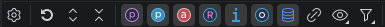

# Legend of the Type System Diagram

## Diagram Settings Pane

Type System Diagram settings are project specific and stored in the `.idea/hybrisDeveloperSpecificProjectSettings.xml`
configuration file.

They can be accessed via Intellij IDEA Settings menu (`[y] SAP CX`>`Type System`>`Diagram Settings`) or
Diagram Toolbar settings action button.

| Setting                                           | Initially                                                                                                                       | Description                                                                                                       |
|---------------------------------------------------|:--------------------------------------------------------------------------------------------------------------------------------|-------------------------------------------------------------------------------------------------------------------|
| Collapse&nbsp;nodes&nbsp;by&nbsp;default          | **checked**                                                                                                                     | Influence Nodes `collapse` state during initial display of the Diagram.                                           |
| Show&nbsp;OOTB&nbsp;Map&nbsp;nodes                | **unchecked**                                                                                                                   | Affects visibility of the **OOTB** _Map_ types as a separate Node.                                                |
| Show&nbsp;custom&nbsp;Atomic&nbsp;nodes           | **unchecked**                                                                                                                   | Affects visibility of the **Custom** non-transitive _Atomic_ types as a separate Node.                            |
| Show&nbsp;custom&nbsp;Collection&nbsp;nodes       | **unchecked**                                                                                                                   | Affects visibility of the **Custom** non-transitive _Collection_ types as a separate Node.                        |
| Show&nbsp;custom&nbsp;Enum&nbsp;nodes             | **unchecked**                                                                                                                   | Affects visibility of the **Custom** non-transitive _Enum_ types as a separate Node.                              |
| Show&nbsp;custom&nbsp;Map&nbsp;nodes              | **unchecked**                                                                                                                   | Affects visibility of the **Custom** non-transitive _Map_ types as a separate Node.                               |
| Show&nbsp;custom&nbsp;Relation&nbsp;nodes         | **unchecked**                                                                                                                   | Affects visibility of the **Custom** non-transitive _Relation_ types without deployment table as a separate Node. |
| Diagram&nbsp;-&nbsp;Excluded&nbsp;Type&nbsp;Names | -&nbsp;GenericItem -&nbsp;Item -&nbsp;LocalizableItem -&nbsp;ExtensibleItem -&nbsp;CronJob -&nbsp;CatalogVersion | Represents case-sensitive Type Names that will be excluded from the Diagram.                                      |

## Diagram Toolbar

| Item                                                                                                                     | Description                                                                                                                                                                                                                     |
|--------------------------------------------------------------------------------------------------------------------------|---------------------------------------------------------------------------------------------------------------------------------------------------------------------------------------------------------------------------------|
|                        | Opens Project specific Type System Diagram settings pane.                                                                                                                                                                       |
|                                 | Restores all manually removed Nodes and triggers Diagram refresh.                                                                                                                                                               |
|                      | Expands all Nodes and triggers Diagram refresh.                                                                                                                                                                                 |
|                    | Collapse all Nodes and triggers Diagram refresh.                                                                                                                                                                                |
|                          | Node `properties` fields related Category Filter                                                                                                                                                                                |
|                     | Node `properties` fields related Category Filter                                                                                                                                                                                |
|                               | Node `custom properties` fields related Category Filter                                                                                                                                                                         |
|                                           | Node `relation ends` fields related Category Filter                                                                                                                                                                             |
|                                         | Node `attributes` fields related Category Filter                                                                                                                                                                                |
|                                                 | Node `indexes` fields related Category Filter                                                                                                                                                                                   |
|                                                   | Node `enum values` fields related Category Filter                                                                                                                                                                               |
|                               | Node `deployment` fields related Category Filter                                                                                                                                                                                |
|  | If enabled shows 1st level of transitive dependencies according to visible Node fields                                                                                                                                          |
|    | Provides two fields visibility levels: `Only Custom Fields` and `All`                                                                                                                                                           |
|                             | Provides four Node related scope levels: `All`, `Custom with Extends`, `Only Custom` and `Only OOTB`. Default is `Custom with Extends`. Caution: ensure to limit down shown nodes before changing scope level to `All`. |
|                          | Triggers re-build of the Diagram in accordance with latest `items.xml` content.                                                                                                                                                 |

## Diagram Edge Elements

| Item                                                                                 | Description                                                                  |
|--------------------------------------------------------------------------------------|------------------------------------------------------------------------------|
|                  | The green arrow corresponds to the `extends` tag in a Item Type declaration. |
|                  | The orange arrow corresponds to the `partOf` relation between Items.         |
|      | The grayed-out arrow corresponds to the `navigable="false"` Relation End.    |
|                    | The blue arrow corresponds to the `one`-`to`-`many` Relation.                |
|  | The blue arrow corresponds to the **optional** `one`-`to`-`many` Relation.   |
|                    | The blue arrow corresponds to the `one`-`to`-`one` Relation.                 |
|  | The blue arrow corresponds to the **optional** `one`-`to`-`one` Relation.    |

## Diagram Node Elements

### Diagram Node Actions

Type System Diagram supports multiple Node Actions, available under Node context menu.

Take a note that each action triggers Diagram Layout & Data refresh.

| Action Name                 | Shortcut    | Description                                                                                            |
|-----------------------------|-------------|--------------------------------------------------------------------------------------------------------|
| Delete                      | D           | Hides corresponding Node.                                                                              |
| Exclude&nbsp;Type&nbsp;Name | Ctrl+Meta+E | Adds Type Name associated with corresponding Node to the project specific list of Excluded Type Names. |
| Collapse&nbsp;Nodes         | C           | Hides all Node fields, such as Attributes, Properties, Indexes, etc.                                   |
| Expand&nbsp;Nodes           | E           | Shows all Node fields, which are allowed to be shown according to Category Visibility settings.        |

### Diagram Node Header

Node tooltip with additional details will be shown on hover over Node Header title.

| State                                                                                                        | Description                                                                                  |
|--------------------------------------------------------------------------------------------------------------|----------------------------------------------------------------------------------------------|
|                                      | Special grayed-out text `collapsed` will be displayed when Node is Collapsed.                | 
|          | The darker Node header background color corresponds to the _Custom_ or _modified OOTB_ Item. |
|  | The lighter Node header background color corresponds to the _OOTB_ Item.                     |

### Diagram Node Fields

| Field                                                                                                | Description                                               |
|------------------------------------------------------------------------------------------------------|-----------------------------------------------------------|
|                                | Lists Deployment tag details of the ItemType or Relation. |
|  | Lists declared Custom Properties for **current** Item.    |
|              | Lists available enum values.                              |
|                | Lists declared Attributes for **current** Item.           |
|          | Lists declared Relation Ends with corresponding icon.     |
|                      | Lists declared Indexes for **current** Item.              |
|                | Lists transitive or indirectly declared Item fields.      |
